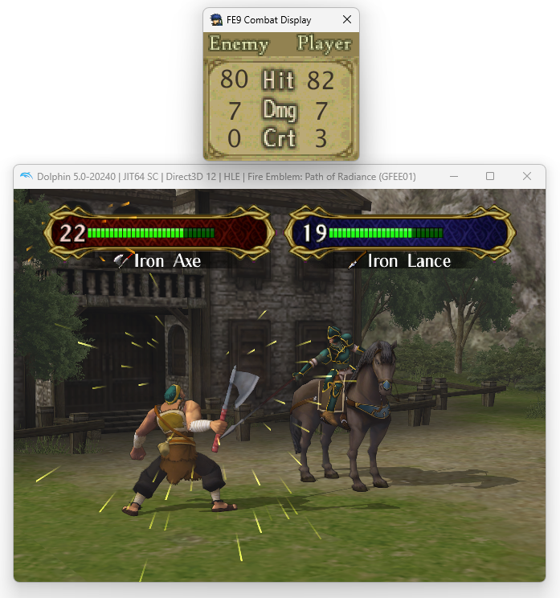

# FE9 Combat Display

Program that displays the combat information for Fire Emblem Path of Radiance.

Works by reading combat infromation from Dolphin's memory.

Works for all versions of the game (USA, JPN, PAL). Only really tested on Dolphin 5.

Works with animations on or off.

## How to use

Download the latest build from the github page [here](https://github.com/TurtleMan64/FE9-Combat-Display/releases/download/1.0/FE9-Combat-Display-1.0.zip) and unzip the files.

Now just run the .exe and the combat display will appear. It will automatically read the combat information from dolphin and display it, no configuration or anything like that needed.

When there is no combat happening, the display will be a solid pink color. This is so it can easily be color-keyed in streaming software.

